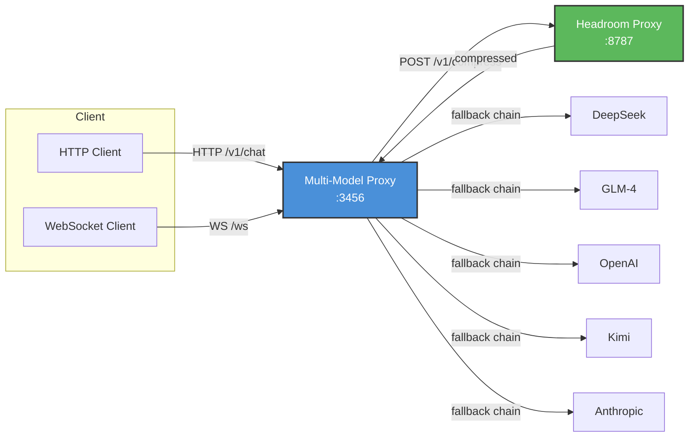

# Multi-Model LLM Proxy with Headroom Compression v2.0

A single proxy endpoint that routes to **Kimi**, **DeepSeek**, **GLM-4**, **OpenAI**, **Anthropic**, and more — with automatic [Headroom](https://github.com/chopratejas/headroom) context compression, **intelligent fallback**, **load balancing**, and **WebSocket streaming**.

---

## Features

| Feature | Description |
|---------|-------------|
| **Multi-Model Routing** | Auto-detect provider from model name, or force via `X-Provider` header |
| **Headroom Compression** | 60–95% token savings via SmartCrusher, CodeCompressor, Kompress-base |
| **Intelligent Fallback** | If DeepSeek fails → auto-retry GLM → then OpenAI (configurable chain) |
| **Load Balancing** | Round-robin across providers by model family (`reasoning`, `coding`, `vision`) |
| **WebSocket API** | Real-time chat over WebSocket with streaming support |
| **Provider Fixes** | Auto-patches Kimi `top_p`, `reasoning_content`, Anthropic `max_tokens`, etc. |
| **Full TypeScript** | Strongly typed, compiled to `dist/`, source maps included |
| **Health Checks** | Per-provider latency and reachability monitoring at `/health` |
| **Token Savings Tracking** | Built-in `/stats` with latency percentiles (p50, p95, p99) |
| **Zero Code Changes** | Drop-in proxy — point your app to `http://localhost:3456` |

---

## Supported Providers

| Provider | Model Examples | Detection Keyword |
|----------|---------------|-------------------|
| **Kimi** (Moonshot) | `kimi-latest`, `moonshot-v1-128k` | `kimi`, `moonshot` |
| **DeepSeek** | `deepseek-chat`, `deepseek-reasoner` | `deepseek` |
| **GLM-4** (Zhipu) | `glm-4`, `glm-4-plus`, `chatglm3` | `glm` |
| **OpenAI** | `gpt-4o`, `gpt-4o-mini`, `o3-mini` | `gpt`, `o1`, `o3` |
| **Anthropic** | `claude-sonnet-4-5-20250929` | `claude`, `anthropic` |

---

## Quick Start

### 1. Install Dependencies

```bash
# Install Node.js dependencies (TypeScript + ws)
npm install

# Install Headroom proxy (requires Python 3.10+)
pip install "headroom-ai[proxy]"
```

### 2. Configure Environment

```bash
cp .env.example .env
# Edit .env and add your API keys
```

### 3. Build & Start

```bash
# Terminal 1: Start Headroom compression proxy
headroom proxy --port 8787

# Terminal 2: Build and start the multi-model router
npm run build
npm start
```

### 4. Use It

```bash
# Health check with per-provider status
curl http://localhost:3456/health | jq

# Auto-detects DeepSeek from model name
curl http://localhost:3456/v1/chat/completions \
  -H "Content-Type: application/json" \
  -d '{"model": "deepseek-chat", "messages": [{"role": "user", "content": "Hello!"}]}'

# Force provider via header
curl http://localhost:3456/v1/chat/completions \
  -H "Content-Type: application/json" \
  -H "X-Provider: kimi" \
  -d '{"model": "kimi-latest", "messages": [{"role": "user", "content": "Hello!"}]}'

# Enable load balancing (round-robin for model family)
curl http://localhost:3456/v1/chat/completions \
  -H "Content-Type: application/json" \
  -H "X-Load-Balance: true" \
  -d '{"model": "deepseek-chat", "messages": [{"role": "user", "content": "Hello!"}]}'

# View stats
curl http://localhost:3456/stats | jq
```

---

## Fallback System

When a provider fails (rate limit, timeout, server error), the proxy automatically tries the next provider in the fallback chain.

### Default Fallback Chain
```
Your Request → DeepSeek (primary)
                    ↓ (rate limited)
              GLM-4 (fallback 1)
                    ↓ (down)
              OpenAI (fallback 2)
```

### Configure
```bash
# .env — customize the fallback chain
FALLBACK_CHAIN=deepseek,glm,openai,kimi
MAX_RETRIES=2
RETRY_DELAY_MS=500
```

### Retryable Errors
- `429` — Rate limited
- `500`, `502`, `503`, `504` — Server/gateway errors
- Network errors: `ECONNRESET`, `timeout`, `socket hang up`

### Response Metadata
Every response includes the full attempt chain:
```json
{
  "choices": [...],
  "_proxy": {
    "provider": "glm",
    "request_id": "a1b2c3d4",
    "attempts": [
      { "provider": "deepseek", "success": false, "status_code": 429, "latency_ms": 120 },
      { "provider": "glm", "success": true, "latency_ms": 890 }
    ]
  }
}
```

---

## Load Balancing

Distribute requests across providers by model family using round-robin.

### Usage
```bash
# Enable load balancing via header
curl ... -H "X-Load-Balance: true"
```

### Default Groups
| Group | Model Keywords | Providers (round-robin) |
|-------|---------------|------------------------|
| `reasoning` | `reasoner`, `thinking`, `o1`, `o3` | DeepSeek → OpenAI |
| `coding` | `code`, `coder` | DeepSeek → GLM → Kimi |
| `vision` | `vision`, `image`, `gpt-4o` | OpenAI → GLM |
| `general` | everything else | Kimi → DeepSeek → GLM |

### Configure
```bash
# .env — customize groups
LOADBALANCE_REASONING=deepseek,openai
LOADBALANCE_CODING=deepseek,glm,kimi
LOADBALANCE_GENERAL=kimi,deepseek,glm
LOADBALANCE_VISION=openai,glm
```

---

## WebSocket API

Connect to `ws://localhost:3456/ws` for real-time bidirectional chat.

### Connect
```javascript
const ws = new WebSocket("ws://localhost:3456/ws");

ws.onopen = () => {
  // Send chat request
  ws.send(JSON.stringify({
    type: "chat",
    payload: {
      model: "deepseek-chat",
      messages: [{ role: "user", content: "Hello!" }],
      stream: true
    }
  }));
};

ws.onmessage = (event) => {
  const msg = JSON.parse(event.data);

  switch (msg.type) {
    case "connected":
      console.log("Connected! Client ID:", msg.clientId);
      break;
    case "stream_start":
      console.log("Stream started, provider:", msg.provider);
      break;
    case "stream_chunk":
      console.log("Chunk:", msg.data);
      break;
    case "stream_end":
      console.log("Stream ended");
      break;
    case "response":
      console.log("Response:", msg.payload);
      break;
    case "error":
      console.error("Error:", msg.error);
      break;
  }
};
```

### WebSocket Message Types
| Type | Direction | Description |
|------|-----------|-------------|
| `connected` | Server → Client | Connection established |
| `ping` / `pong` | Both | Keepalive |
| `chat` | Client → Server | Send a chat completion request |
| `stream_start` | Server → Client | Streaming begins |
| `stream_chunk` | Server → Client | SSE chunk data |
| `stream_end` | Server → Client | Streaming complete |
| `response` | Server → Client | Non-streaming response |
| `error` | Server → Client | Error occurred |

---

## VS Code / Copilot Integration

### Option A: Environment Variable

```bash
export OPENAI_API_BASE=http://localhost:3456/v1
export OPENAI_API_KEY=your-key-here
code .
```

### Option B: VS Code Settings

```json
{
  "github.copilot.advanced": {
    "debug.overrideEngine": "kimi-latest",
    "debug.testOverrideProxyUrl": "http://localhost:3456",
    "debug.overrideProxyUrl": "http://localhost:3456"
  }
}
```

### Option C: Custom SDK Client

```typescript
import OpenAI from "openai";

const client = new OpenAI({
  baseURL: "http://localhost:3456/v1",
  apiKey: "dummy", // proxy replaces with real key from .env
  defaultHeaders: {
    "X-Provider": "kimi",         // or let auto-detect
    // "X-Load-Balance": "true",  // enable load balancing
  },
});

const response = await client.chat.completions.create({
  model: "kimi-latest",
  messages: [{ role: "user", content: "Hello!" }],
});
```

---

## Headroom Compression

[Headroom](https://github.com/chopratejas/headroom) compresses tool outputs, logs, RAG chunks, files, and conversation history before they reach the LLM.

### How It Works

```
Your App / Copilot
    │
    │  POST /v1/chat/completions
    ▼
┌──────────────────────────────────────────────────────┐
│  Multi-Model Proxy v2.0                              │
│  ─────────────────────────────────────────────────   │
│  1. Detect provider from model / header              │
│  2. [Optional] Load balance → select provider        │
│  3. Compress messages via Headroom proxy             │
│     → SmartCrusher (JSON)                            │
│     → CodeCompressor (AST)                           │
│     → Kompress-base (ML text)                        │
│     → CacheAligner (KV cache optimization)           │
│  4. Apply provider-specific patches                  │
│  5. Try primary provider                             │
│     → if fails, fallback to next in chain            │
│  6. Return response with metadata                    │
└──────────────────────────────────────────────────────┘
    │
    │  compressed prompt + CCR retrieval tool
    ▼
LLM Provider (Kimi / DeepSeek / GLM / OpenAI / Anthropic)
```

### Configuration

| Env Var | Default | Description |
|---------|---------|-------------|
| `HEADROOM_ENABLED` | `true` | Enable/disable compression |
| `HEADROOM_BASE_URL` | `http://localhost:8787` | Headroom proxy URL |
| `HEADROOM_API_KEY` | — | Headroom Cloud API key |
| `HEADROOM_MODEL` | `gpt-4o` | Model for token counting |
| `HEADROOM_FALLBACK` | `true` | Use uncompressed if Headroom fails |
| `HEADROOM_TIMEOUT_MS` | `30000` | Compression timeout |

### Stats

```bash
curl http://localhost:3456/stats | jq
```

```json
{
  "totalRequests": 150,
  "compressedRequests": 142,
  "totalTokensBefore": 523000,
  "totalTokensAfter": 156900,
  "totalTokensSaved": 366100,
  "providerCounts": { "kimi": 50, "deepseek": 60, "glm": 30, "openai": 10 },
  "fallbackCounts": { "deepseek→glm": 5, "glm→openai": 2 },
  "latencySummary": {
    "deepseek": { "avg": 450, "p50": 380, "p95": 1200, "p99": 2100 },
    "kimi": { "avg": 320, "p50": 280, "p95": 800, "p99": 1500 }
  }
}
```

---

## Architecture



---

## Project Structure

```
├── src/
│   ├── types.ts       # All TypeScript interfaces
│   ├── config.ts      # Configuration loader
│   ├── logger.ts      # Colored logging utility
│   ├── stats.ts       # In-memory statistics tracker
│   ├── headroom.ts    # Headroom compression client
│   ├── fallback.ts    # Fallback & load-balancing engine
│   ├── patcher.ts     # Provider-specific payload patches
│   ├── streaming.ts   # SSE / streaming utilities
│   ├── proxy.ts       # Main HTTP + WebSocket server
│   └── index.ts       # Entry point
├── dist/              # Compiled JavaScript (tsc output)
├── package.json
├── tsconfig.json
├── .env.example
└── README.md
```

---

## Development

```bash
# Build
npm run build

# Watch mode (auto-rebuild on changes)
npm run watch

# Dev mode with ts-node (no build needed)
npm run dev

# Clean build artifacts
npm run clean
```

---

## Provider-Specific Patches

### Kimi (Moonshot)
- Forces `top_p = 0.95`
- Backfills `reasoning_content = ""` on assistant tool_calls

### DeepSeek
- Supports `reasoning_effort` natively
- No special patches

### GLM (Zhipu)
- Routes to `open.bigmodel.cn/api/paas/v4`
- Handles Bearer token format

### Anthropic
- Converts `max_completion_tokens` → `max_tokens`
- Adds `anthropic-version` header

---

## Troubleshooting

### "Headroom compression failed"
- Ensure Headroom proxy is running: `headroom proxy --port 8787`
- Check `HEADROOM_BASE_URL` in `.env`
- Set `HEADROOM_FALLBACK=true` to proceed uncompressed

### "All providers failed"
- Check that at least one provider API key is set in `.env`
- Check `/health` to see provider status
- Verify network connectivity to provider APIs

### "Missing API key for X"
- Add the corresponding key to `.env`
- Restart the proxy after editing `.env`

---

## License

MIT
