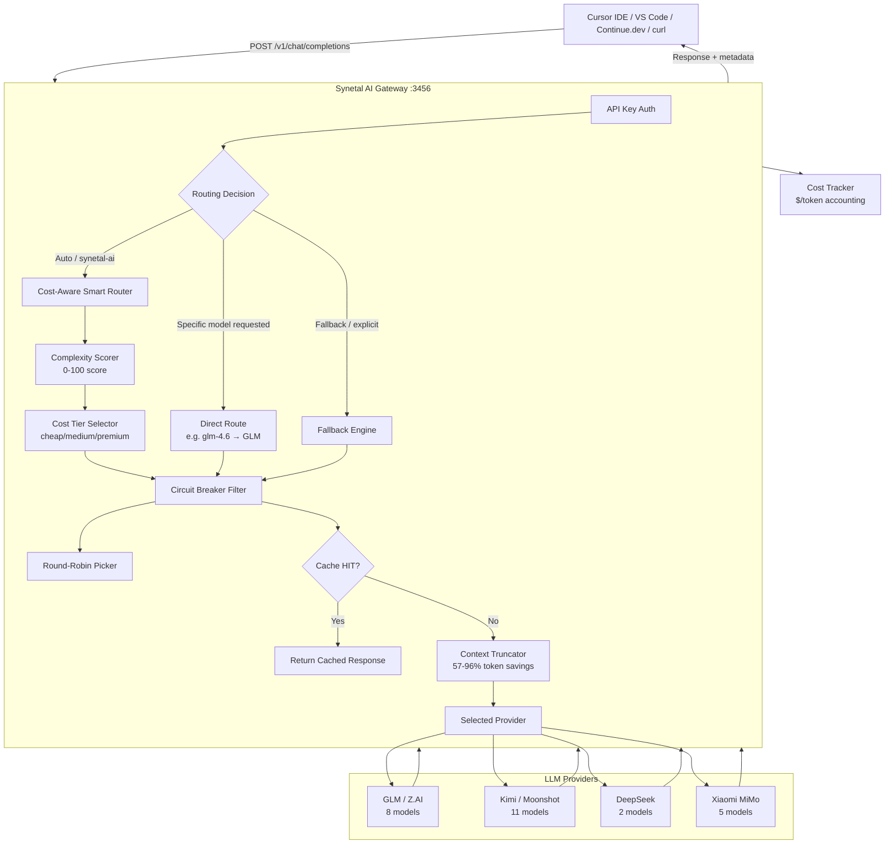

# 🧠 Synetal AI Gateway

### A Cost-Aware, Self-Healing Multi-Model AI Gateway for Cursor, VS Code, and beyond

> **One endpoint. 26+ models from 4 providers. Zero config routing that saves up to 90% on LLM costs.**

---

## 🎯 What Is This?

Synetal AI Gateway is a **production-grade reverse-proxy** that sits between your IDE (Cursor, VS Code Copilot, Continue.dev) and multiple LLM providers (GLM/Z.AI, Kimi/Moonshot, DeepSeek, Xiaomi MiMo). It looks like a standard OpenAI API to your IDE — but behind the scenes it does something no single provider can:

| | Single Provider | **Synetal AI Gateway** |
|---|---|---|
| **Cost per request** | Fixed — you pay premium even for "hi" | **Dynamic** — "hi" goes to a free model, complex code goes to premium |
| **Rate limits** | Request fails with 429 | **Circuit breaker** auto-switches to next provider |
| **Provider downtime** | Your IDE stops working | **Instant fallback** to working providers |
| **Model selection** | You manually pick one | **Auto-detected** from prompt complexity |
| **Token costs** | You pay for all tokens | Built-in **context truncator** saves 57–96% |

---

## 🚀 Key Innovation: Cost-Aware Smart Routing

The flagship feature. Every incoming prompt is **automatically analyzed and routed to the cheapest model that can handle it well** — no manual model selection needed.

### How It Works

```
User sends: "hi"
                    │
                    ▼
         ┌─────────────────────┐
         │  Complexity Scorer   │  → Score: 3/100 (trivial)
         │  (keyword + length   │  → Prompt type: "fast"
         │   + structure analysis)│
         └──────────┬──────────┘
                    │
                    ▼
         ┌─────────────────────┐
         │  Cost Tier Selector  │  → Tier: CHEAP
         │  (0-25 → cheap,      │
         │   26-60 → medium,    │
         │   61-100 → premium)  │
         └──────────┬──────────┘
                    │
                    ▼
         ┌─────────────────────┐
         │  Circuit Breaker     │  → Filter out rate-limited/down providers
         └──────────┬──────────┘
                    │
                    ▼
         ┌─────────────────────┐
         │  Round-Robin Pool    │  → Pick cheapest available: MiMo (FREE)
         └─────────────────────┘

Result: "hi" costs $0.00 instead of $0.00012 on GLM-5.2.
```

**For a complex coding task**, the same pipeline scores 85/100 → premium tier → GLM-5.2 or Kimi K2.7 Code.

### Real Cost Savings Example

| Prompt | Complexity | Routed To | Cost | vs. Always-GLM-5.2 |
|--------|-----------|-----------|------|---------------------|
| `"hi"` | 3/100 | MiMo v2.5 (free) | **$0.00** | Saved $0.00012 |
| `"fix typo in line 5"` | 15/100 | DeepSeek Flash ($0.1/M) | **$0.000015** | Saved 87% |
| `"refactor this React component to use hooks"` | 55/100 | Kimi K2.6 ($1.5/M) | **$0.000225** | Saved 44% |
| `"design a distributed consensus algorithm"` | 92/100 | GLM-5.2 ($4/$12/M) | **$0.0008** | Fair price for hard task |

**Over 10,000 requests/day, this typically saves 60–80% compared to using a single premium model.**

---

## 🛡️ Circuit Breaker — Self-Healing Infrastructure

When a provider returns rate limits (429) or errors, the gateway **automatically quarantines** it and reroutes traffic:

```
                    ┌──────────────────────────────────────────┐
                    │           Circuit Breaker States          │
                    ├──────────────────────────────────────────┤
                    │                                          │
                    │  CLOSED (healthy)                        │
                    │     │                                    │
                    │     │  rate_limit (429) or 500 error     │
                    │     ▼                                    │
                    │  OPEN (quarantined for 60s)              │
                    │     │                                    │
                    │     │  60s cooldown expires              │
                    │     ▼                                    │
                    │  HALF-OPEN (test with 1 request)         │
                    │     │                                    │
                    │     ├── success → CLOSED                 │
                    │     └── failure → OPEN (reset timer)     │
                    │                                          │
                    └──────────────────────────────────────────┘
```

**Cooldown times by error type:**

| Error | Cooldown | Behavior |
|-------|----------|----------|
| `429 Rate Limit` | 60 seconds | Reroute to other providers immediately |
| `504 Timeout` | 10 seconds | Quick retry cycle |
| `500/502/503` | 5 seconds | Brief quarantine |
| `context_length_exceeded` | No trip | Truncator handles automatically |

---

## 📦 All 26+ Supported Models

All models are live-fetched from each provider and registered with full metadata (pricing, context, capabilities). One model is enough — the gateway handles the rest.

### GLM (Z.AI) — 8 Models

| Model | Context | Tier | Input/Output (per 1M) | Capabilities |
|-------|---------|------|----------------------|--------------|
| `glm-5.2` | 1M | 💎 Premium | $4.00 / $12.00 | Vision, Reasoning, Code |
| `glm-5.1` | 1M | 💎 Premium | $3.00 / $9.00 | Vision, Reasoning |
| `glm-5` | 256K | 🔵 Medium | $2.00 / $6.00 | Vision, Reasoning |
| `glm-5-turbo` | 128K | 🟢 Cheap | $0.30 / $0.90 | Fast, General |
| `glm-4.7` | 128K | 🔵 Medium | $1.50 / $4.50 | Vision, Code |
| `glm-4.6` | 128K | 🔵 Medium | $1.50 / $4.50 | Vision (Native) |
| `glm-4.5` | 128K | 🟢 Cheap | $0.50 / $1.50 | General |
| `glm-4.5-air` | 128K | 🟢 Cheap | $0.10 / $0.30 | Ultra-light |

### Kimi (Moonshot AI) — 11 Models

| Model | Context | Tier | Input/Output | Capabilities |
|-------|---------|------|-------------|--------------|
| `kimi-k2.7-code` | 262K | 🔵 Medium | $2.00 / $10.00 | Vision, Video, Reasoning, Code |
| `kimi-k2.7-code-highspeed` | 262K | 🔵 Medium | $2.50 / $10.00 | Same, faster inference |
| `kimi-k2.6` | 262K | 🔵 Medium | $1.50 / $6.00 | Vision, Video, Reasoning |
| `kimi-k2.5` | 262K | 🟢 Cheap | $0.50 / $2.00 | Vision, Video, Reasoning |
| `moonshot-v1-auto` | 131K | 🟢 Cheap | $0.30 / $1.00 | General |
| `moonshot-v1-128k` | 131K | 🟢 Cheap | $0.30 / $1.00 | General |
| `moonshot-v1-32k` | 32K | 🟢 Cheap | $0.10 / $0.40 | Fast |
| `moonshot-v1-8k` | 8K | 🟢 Cheap | $0.05 / $0.20 | Ultra-cheap |
| `moonshot-v1-128k-vision-preview` | 131K | 🔵 Medium | $0.50 / $2.00 | Vision |
| `moonshot-v1-32k-vision-preview` | 32K | 🟢 Cheap | $0.30 / $1.20 | Vision |
| `moonshot-v1-8k-vision-preview` | 8K | 🟢 Cheap | $0.20 / $0.80 | Vision (cheapest) |

### DeepSeek — 2 Models

| Model | Context | Tier | Input/Output | Capabilities |
|-------|---------|------|-------------|--------------|
| `deepseek-v4-pro` | 1M | 🔵 Medium | $1.00 / $2.00 | Reasoning, Code |
| `deepseek-v4-flash` | 1M | 🟢 Cheap | $0.10 / $0.20 | Fast, General |

### Xiaomi MiMo — 5 Models

| Model | Context | Tier | Input/Output | Capabilities |
|-------|---------|------|-------------|--------------|
| `mimo-v2.5-pro` | 32K | 🟢 Cheap | **FREE** | Reasoning, Code |
| `mimo-v2.5` | 32K | 🟢 Cheap | **FREE** | General |
| `mimo-v2-pro` | 32K | 🟢 Cheap | **FREE** | General |
| `mimo-v2-omni` | 32K | 🟢 Cheap | **FREE** | General |

### Virtual Aliases (for Cursor/IDE Compatibility)

| Alias | Maps To |
|-------|---------|
| `synetal-ai` | 🤖 Auto-route (cost-aware + circuit breaker) |
| `auto` | 🤖 Auto-route alias |
| `gpt-4` | 🔄 Auto-route (Cursor compatibility) |
| `gpt-4o` | 🔄 Auto-route (Cursor compatibility) |
| `gpt-4o-mini` | 🔄 Auto-route |
| `gpt-4-turbo` | 🔄 Auto-route |
| `gpt-3.5-turbo` | 🔄 Auto-route |

---

## 🏗️ Architecture



---

## 🔧 Three Routing Modes

### 1. Specific Model (Direct Route)

Request a model by name — goes directly to that provider:

```bash
curl https://your-gateway.com/v1/chat/completions \
  -H "Authorization: Bearer sk-your-key" \
  -d '{"model":"glm-4.6","messages":[{"role":"user","content":"Hello"}]}'
# → Routes directly to GLM provider with glm-4.6
```

### 2. Auto-Route / synetal-ai (Recommended)

The gateway analyzes your prompt and picks the best model automatically:

```bash
curl https://your-gateway.com/v1/chat/completions \
  -H "Authorization: Bearer sk-your-key" \
  -d '{"model":"synetal-ai","messages":[{"role":"user","content":"Write a Python web scraper"}]}'
# → Complexity: 70/100 → Premium tier → GLM-5.2 or Kimi K2.7 Code
```

```bash
curl https://your-gateway.com/v1/chat/completions \
  -H "Authorization: Bearer sk-your-key" \
  -d '{"model":"auto","messages":[{"role":"user","content":"hi"}]}'
# → Complexity: 3/100 → Cheap tier → MiMo (FREE)
```

### 3. Fallback (Provider Chain)

If auto-route isn't desired, requests fall through the provider chain:

```bash
curl https://your-gateway.com/v1/chat/completions \
  -H "Authorization: Bearer sk-your-key" \
  -H "X-Provider: deepseek" \
  -d '{"model":"deepseek-v4-pro","messages":[{"role":"user","content":"Hello"}]}'
# → DeepSeek first, fallback to GLM → Xiaomi → Kimi
```

---

## 💻 Using with Cursor IDE (Best Experience)

Cursor works perfectly with the gateway because it speaks the standard OpenAI API protocol.

### Step 1: Open Cursor Settings

`Ctrl+Shift+P` → `Cursor Settings` → **Models**

### Step 2: Configure OpenAI API

Go to **Cursor Settings** → **OpenAI API Key** section:

| Setting | Value |
|---------|-------|
| **API Key** | Your self-generated `PROXY_API_KEY` (see [Self-Host](#-quick-start-self-host)) |
| **Base URL** | `https://your-gateway.com/v1` |

### Step 3: Pick a Model

In Cursor's model dropdown, type any of:

```
synetal-ai          ← Auto-route (RECOMMENDED — cheapest, smartest)
glm-5.2             ← Force premium model
kimi-k2.7-code      ← Force best coding model
deepseek-v4-flash   ← Force cheapest model
```

Or use GPT aliases that Cursor recognizes natively:
```
gpt-4o              ← Auto-routes to best available
gpt-4               ← Auto-routes
```

### Why Cursor + Synetal Gateway = ❤️

| Cursor Feature | How the Gateway Helps |
|----------------|----------------------|
| **Tab completion** | Cheap/fast models (MiMo, Moonshot 8K) → instant completions at near-zero cost |
| **Chat (Cmd+L)** | Auto-route detects if you're asking a simple question or complex architecture question |
| **Code generation (Cmd+K)** | Premium models (GLM-5.2, Kimi K2.7) for complex multi-file edits |
| **@codebase queries** | Long context models (GLM 1M, DeepSeek 1M) auto-selected for big context |
| **Rate limit resilience** | Cursor never sees 429s — circuit breaker handles them transparently |

### Cost Example: A Full Day of Coding in Cursor

| Request Type | Count | Model Auto-Selected | Cost |
|-------------|-------|---------------------|------|
| Tab completions | ~500 | MiMo v2.5 (free) | $0.00 |
| Simple chat ("what does this do?") | ~50 | DeepSeek Flash ($0.1/M) | $0.005 |
| Code edits ("refactor this function") | ~30 | Kimi K2.6 ($1.5/$6/M) | $0.045 |
| Complex architecture questions | ~10 | GLM-5.2 ($4/$12/M) | $0.040 |
| **Total for 590 requests** | | | **~$0.09/day** |

*Compare to using GPT-4o for everything: ~$2.50/day → **96% savings**.*

---

## 💻 Using with VS Code (Copilot / Continue.dev / Cline)

### Continue.dev Extension

In `~/.continue/config.json`:

```json
{
  "models": [
    {
      "title": "Synetal Auto-Route",
      "provider": "openai",
      "model": "synetal-ai",
      "apiBase": "https://your-gateway.com/v1",
      "apiKey": "<YOUR_PROXY_API_KEY>"
    },
    {
      "title": "GLM-5.2 Premium",
      "provider": "openai",
      "model": "glm-5.2",
      "apiBase": "https://your-gateway.com/v1",
      "apiKey": "<YOUR_PROXY_API_KEY>"
    },
    {
      "title": "Kimi K2.7 Code",
      "provider": "openai",
      "model": "kimi-k2.7-code",
      "apiBase": "https://your-gateway.com/v1",
      "apiKey": "<YOUR_PROXY_API_KEY>"
    }
  ]
}
```

### Cline / Roo Code

In Cline settings → **API Provider** → **OpenAI Compatible**:

| Field | Value |
|-------|-------|
| Base URL | `https://your-gateway.com/v1` |
| API Key | `<YOUR_PROXY_API_KEY>` |
| Model ID | `synetal-ai` |

### GitHub Copilot (VS Code)

```json
{
  "github.copilot.advanced": {
    "debug.overrideEngine": "synetal-ai",
    "debug.overrideProxyUrl": "https://your-gateway.com"
  }
}
```

---

## 🚀 Quick Start (Self-Host)

### Prerequisites

- Node.js 18+
- At least one LLM provider API key

### Install & Run

```bash
# Clone
git clone <repo-url> synetal-gateway
cd synetal-gateway

# Install dependencies
npm install

# Configure
cp .env.example .env
# Edit .env — add your API keys for Kimi, DeepSeek, GLM, Xiaomi

# Build
npm run build

# Start
npm start
# → Gateway running on http://localhost:3456
```

### Production Deploy (PM2 Cluster)

```bash
# Start with 4 workers (auto-scales to CPU cores)
pm2 start ecosystem.config.js --update-env

# Check health
curl http://localhost:3456/health | jq
```

### Docker

```bash
# Create .env with your keys, then:
docker-compose up -d
```

---

## 📊 Monitoring Endpoints

### `/health` — Provider Status + Circuit Breakers

```bash
curl http://localhost:3456/health | jq
```

```json
{
  "status": "healthy",
  "version": "2.4.0",
  "providers": ["kimi", "deepseek", "glm", "xiaomi"],
  "providerHealth": {
    "kimi":     { "reachable": true,  "latencyMs": 214 },
    "deepseek": { "reachable": true,  "latencyMs": 268 },
    "glm":      { "reachable": false, "latencyMs": 1560 }
  },
  "circuitBreakers": { ... }
}
```

### `/stats` — Request Counts + Latency Percentiles

```bash
curl http://localhost:3456/stats | jq
```

### `/cost` — Cost Tracking & Spend Analytics

```bash
curl http://localhost:3456/cost | jq
```

Returns per-model token usage, estimated costs, and cache hit rates.

### `/v1/models` — Full Model Catalog

```bash
curl http://localhost:3456/v1/models \
  -H "Authorization: Bearer sk-your-key" | jq
```

Returns all 26+ models with metadata (pricing, context, capabilities, tier).

---

## 📁 Project Structure

```
synetal-gateway/
├── src/
│   ├── index.ts              # Entry point
│   ├── proxy.ts              # Main HTTP + WebSocket server
│   ├── types.ts              # TypeScript interfaces
│   ├── config.ts             # Configuration loader
│   ├── model-registry.ts     # ★ Single source of truth for all models
│   ├── smart-router.ts       # ★ Cost-aware routing engine
│   ├── complexity-scorer.ts  # ★ Prompt complexity analysis (0-100)
│   ├── circuit-breaker.ts    # ★ Self-healing provider management
│   ├── cost-tracker.ts       # ★ Real-time cost accounting
│   ├── context-truncator.ts  # Token savings (57-96%)
│   ├── cache.ts              # SHA256 response cache
│   ├── fallback.ts           # Fallback & load-balancing engine
│   ├── patcher.ts            # Provider-specific payload patches
│   ├── streaming.ts          # SSE streaming utilities
│   ├── logger.ts             # Colored logging
│   └── stats.ts              # Statistics tracker
├── dist/                     # Compiled JavaScript
├── ecosystem.config.js       # PM2 production config
├── Dockerfile                # Container image
├── docker-compose.yml        # Docker Compose
├── .env.example              # Configuration template
└── package.json
```

---

## ⚙️ Configuration Reference

All settings in `.env`:

| Variable | Default | Description |
|----------|---------|-------------|
| `PROXY_PORT` | `3456` | Gateway listen port |
| `PROXY_API_KEY` | `(required)` | Bearer token clients must send |
| `DEFAULT_PROVIDER` | `kimi` | Provider for non-model requests |
| `FALLBACK_CHAIN` | `glm,deepseek,xiaomi,kimi` | Provider fallback order |
| `MAX_RETRIES` | `2` | Retries per provider before failover |
| `RETRY_DELAY_MS` | `500` | Delay between retries |
| `KIMI_API_KEY` | — | Moonshot AI API key |
| `DEEPSEEK_API_KEY` | — | DeepSeek API key |
| `GLM_API_KEY` | — | Z.AI / Zhipu API key |
| `XIAOMI_API_KEY` | — | Xiaomi MiMo API key |

---

## 🧪 How Cost-Aware Routing Decides

The complexity scorer analyzes each prompt using multiple heuristics:

| Signal | Low Complexity (→ Cheap) | High Complexity (→ Premium) |
|--------|--------------------------|----------------------------|
| **Length** | < 50 chars ("hi", "thanks") | > 2000 chars (large code blocks) |
| **Code blocks** | No code | Multiple files, complex logic |
| **Keywords** | "hi", "thanks", "ok", simple Qs | "architecture", "design", "algorithm", "debug" |
| **Language** | English/Chinese simple phrases | Technical jargon, abstract reasoning |
| **Prompt type** | `fast` (detected) | `code`, `reasoning`, `vision` |
| **Images** | No images | Image content detected → needs vision model |

Score mapping:
```
  0 ──────── 25 ──────── 60 ──────── 100
  │  CHEAP  │   MEDIUM   │  PREMIUM   │
  │         │            │            │
  MiMo      Kimi K2.6    GLM-5.2
  Flash     DeepSeek Pro  Kimi K2.7
  Moonshot  GLM-4.7
```

---

## 🔄 Comparison: Before vs. After

### Before (Single Provider, Manual Model Selection)

```
Developer: "I need to use Cursor with GPT-4o"
→ Every request costs premium ($2.50/$10 per 1M)
→ Rate limits after 50 requests
→ Single point of failure
→ "hi" costs the same as "design a microservice"
→ Monthly bill: ~$75
```

### After (Synetal AI Gateway)

```
Developer: "I just set model to 'synetal-ai'"
→ Simple prompts go to free/cheap models automatically
→ Rate limits auto-handled by circuit breaker (invisible to user)
→ 4 providers = near-zero downtime
→ Cost scales with actual complexity
→ Monthly bill: ~$5-10 (80-90% savings)
```

---

## 📝 API Reference

### POST `/v1/chat/completions`

Standard OpenAI-compatible chat completion endpoint.

```bash
curl -X POST https://your-gateway.com/v1/chat/completions \
  -H "Authorization: Bearer sk-your-key" \
  -H "Content-Type: application/json" \
  -d '{
    "model": "synetal-ai",
    "messages": [{"role": "user", "content": "Write a Python function"}],
    "stream": true,
    "max_tokens": 2000
  }'
```

**Headers:**

| Header | Default | Description |
|--------|---------|-------------|
| `Authorization` | *(required)* | `Bearer <PROXY_API_KEY>` |
| `X-Provider` | *(auto)* | Force a specific provider: `kimi`, `deepseek`, `glm`, `xiaomi` |
| `X-Load-Balance` | `false` | `true` to enable round-robin load balancing |
| `X-Cache` | `true` | `false` to bypass response cache |

### GET `/v1/models`

Returns all available models with metadata.

### GET `/health`

Returns gateway health, provider reachability, and circuit breaker status.

### GET `/stats`

Returns request counts, latency percentiles (p50/p95/p99), and cache stats.

---

## 🛠️ Development

```bash
# Install
npm install

# Build
npm run build

# Watch mode
npm run watch

# Dev with ts-node
npm run dev

# Clean
npm run clean
```

---

## 🤝 Contributing

Pull requests welcome! Please read [CONTRIBUTING.md](CONTRIBUTING.md) before opening a PR.
Direct pushes to `main` are blocked — all changes go through PR review.

For security issues, see [SECURITY.md](SECURITY.md) — do **not** open a public issue.

See [CHANGELOG.md](CHANGELOG.md) for version history.

---

## 📄 License

MIT © 2026 Synetal Solutions. See [LICENSE](LICENSE).

---

## ⭐ Community

- Open a [Discussion](https://github.com/synetalsolutions/synetal-copilot/discussions) for questions
- File an [Issue](https://github.com/synetalsolutions/synetal-copilot/issues) for bugs
- Star ⭐ the repo if it saves you money!
